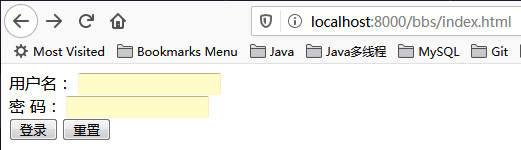
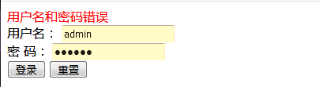

## 论坛登录系统

This is a simple forum system built by SSM[简易论坛登录]

### 项目说明
|   持久层   |   业务层   |  展现层  |  Web服务器  |
|   :----:     |    :----:    |   :----:   |   :--------------:  |
|  MyBatis  |  Spring声明式事务  |  Spring MVC  |  Jetty  |

该项目分为2个分支

|    分支   | 所用框架 |
| :---: | :----: |
| [master](https://github.com/bluJoker/forumSSM/tree/master) | Spring |
| [springboot](https://github.com/bluJoker/forumSSM/tree/springboot) | Spring Boot|

### Change log
- 2019/11/26 Spring4.x-不带事务aop及SpringMVC的初级版本
- 2019/11/28 对业务类中loginSuccess方法添加事务管理(基于aop/tx命名空间配置)
- 2019/11/30 JdbcTemplate整合为MyBatis
- 2019/11/31 整合前端SpringMVC
- 2020/01/15 Spring转为SpringBoot

### 运行截图
- 初始登录页面：

- 登录失败页面：

- 登录成功页面：

- 注册成功页面：

